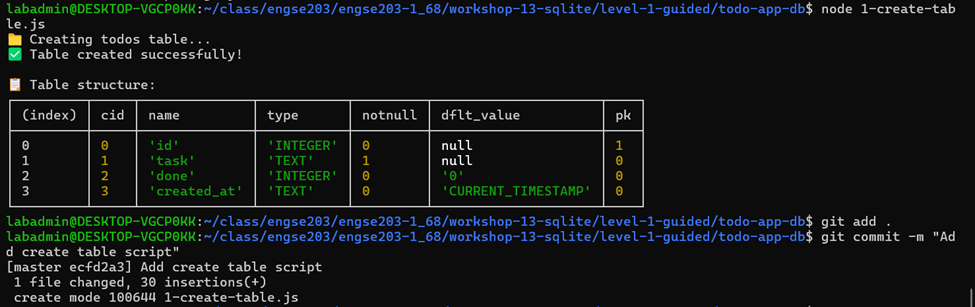
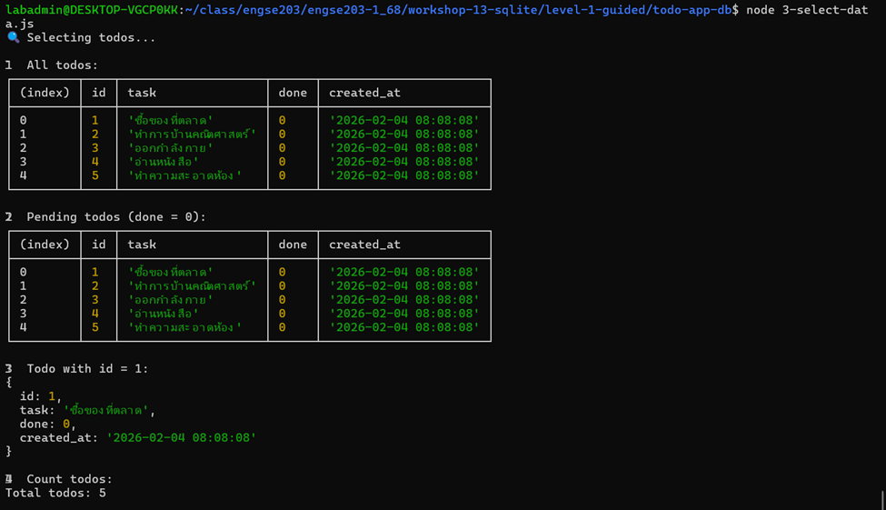
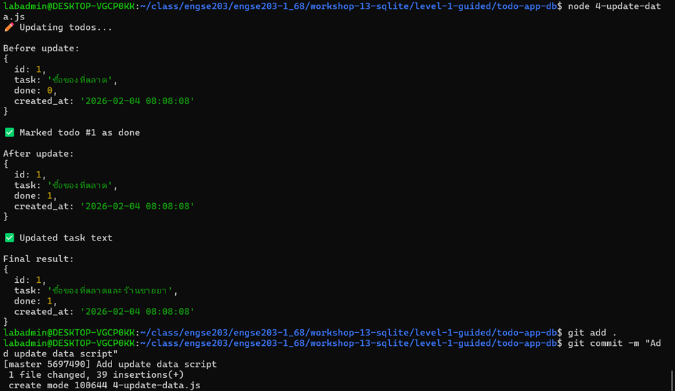
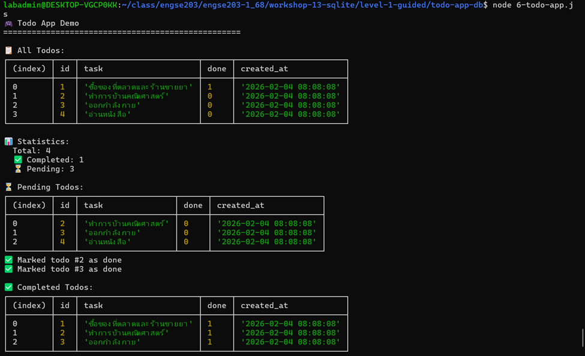
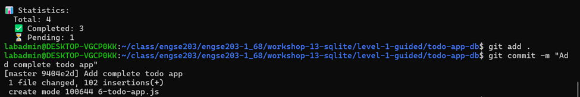

# 📊 บันทึกผลการทดลอง - Workshop 13 Level 1

## 👤 ผู้ทดลอง
- **ชื่อ:** วิศรุต กอบคำ
- **วันที่:** 4 กุมภาพันธ์ 2026

---

## 📝 ส่วนที่ 1: สร้าง Table

### สร้างตาราง (Create Table)
**คำสั่งที่ใช้:**
```bash
node 1-create-table.js
```

**ผลลัพธ์:**


---

### เพิ่มข้อมูล (Insert Data)

**คำสั่งที่ใช้:**
```bash
node 2-insert-data.js
```

**ผลลัพธ์:**


---

### แสดงข้อมูล (Select Data)

**คำสั่งที่ใช้:**
```bash
node 3-select-data.js
```

**ผลลัพธ์:**



---

### แก้ไขข้อมูล (Update Data)

**คำสั่งที่ใช้:**
```bash
node 4-update-data.js
```

**ผลลัพธ์:**


---

### ลบข้อมูล (Delete Data)

**คำสั่งที่ใช้:**
```bash
node 5-delete-data.js
```

**ผลลัพธ์:**


---

### Todo Application

**คำสั่งที่ใช้:**
```bash
node 6-todo-app.js
```

**ผลลัพธ์:**



---

## 🎯 Challenge Tasks

### Challenge 1: ค้นหา todo (Search Todos)

**ฟังก์ชันที่พัฒนา:**
```javascript
searchTodos(keyword) {
  const todos = db.prepare('SELECT * FROM todos WHERE task LIKE ?').all(`%${keyword}%`);
  console.log(`\n🔍 Search results for "${keyword}":`);
  if (todos.length > 0) {
    console.table(todos);
    console.log(`Found ${todos.length} todo(s)`);
  } else {
    console.log('❌ No todos found');
  }
}
```

**คำสั่งที่ใช้:**
```bash
node 6-todo-app.js
```

**ผลลัพธ์:**


**คำอธิบาย:** ใช้ SQL `LIKE` operator กับ wildcard `%` เพื่อค้นหา todos ที่มีคำค้นหาอยู่ในข้อความ

---

### Challenge 2: แก้ไข task (Update Task)

**ฟังก์ชันที่พัฒนา:**
```javascript
updateTask(id, newTask) {
  const update = db.prepare('UPDATE todos SET task = ? WHERE id = ?');
  const result = update.run(newTask, id);
  if (result.changes > 0) {
    console.log(`✏️ Updated todo #${id} to: "${newTask}"`);
  } else {
    console.log(`❌ Todo #${id} not found`);
  }
}
```

**คำสั่งที่ใช้:**
```bash
node 6-todo-app.js
```

**ผลลัพธ์:**


**คำอธิบาย:** ใช้ SQL `UPDATE` เพื่ออัพเดตข้อความของ todo ตาม ID ที่ระบุ

---

### Challenge 3: ลบที่เสร็จหมด (Clear Completed)

**ฟังก์ชันที่พัฒนา:**
```javascript
clearCompleted() {
  const del = db.prepare('DELETE FROM todos WHERE done = 1');
  const result = del.run();
  console.log(`🗑️ Cleared ${result.changes} completed todo(s)`);
}
```

**คำสั่งที่ใช้:**
```bash
node 6-todo-app.js
```

**ผลลัพธ์:**


**คำอธิบาย:** ใช้ SQL `DELETE` พร้อมเงื่อนไข `WHERE done = 1` เพื่อลบ todos ที่เสร็จแล้วทั้งหมด

---

### Challenge 4: เรียงลำดับตามวันที่ (Show By Date)

**ฟังก์ชันที่พัฒนา:**
```javascript
showByDate() {
  const todos = db.prepare('SELECT * FROM todos ORDER BY created_at DESC').all();
  console.log('\n📅 Todos by date (newest first):');
  console.table(todos);
}
```

**คำสั่งที่ใช้:**
```bash
node 6-todo-app.js
```

**ผลลัพธ์:**


**คำอธิบาย:** ใช้ SQL `ORDER BY created_at DESC` เพื่อเรียงลำดับ todos จากใหม่สุดไปเก่าสุด

---

---

## 📌 สรุปผลการทดลอง

### ความสำเร็จ
#### ฟังก์ชันพื้นฐาน
- ✅ สามารถสร้างตาราง todos ได้สำเร็จ
- ✅ สามารถเพิ่มข้อมูลลงในตารางได้
- ✅ สามารถแสดงข้อมูลจากตารางได้
- ✅ สามารถแก้ไขข้อมูลในตารางได้
- ✅ สามารถลบข้อมูลจากตารางได้
- ✅ แอปพลิเคชัน Todo ทำงานได้ครบทุกฟังก์ชัน

#### Challenge Tasks
- ✅ Challenge 1: พัฒนาฟังก์ชันค้นหา todo สำเร็จ
- ✅ Challenge 2: พัฒนาฟังก์ชันแก้ไข task สำเร็จ
- ✅ Challenge 3: พัฒนาฟังก์ชันลบที่เสร็จหมดสำเร็จ
- ✅ Challenge 4: พัฒนาฟังก์ชันเรียงลำดับตามวันที่สำเร็จ

### สิ่งที่ได้เรียนรู้
1. **การใช้งาน SQLite3 กับ Node.js** - เรียนรู้การเชื่อมต่อและใช้งานฐานข้อมูล SQLite
2. **CRUD Operations** - การทำงานกับ Create, Read, Update, Delete อย่างครบถ้วน
3. **SQL Queries ขั้นสูง** - การใช้ LIKE, ORDER BY, และ WHERE clauses
4. **การจัดการฐานข้อมูล** - การใช้ better-sqlite3 แบบ synchronous
5. **การสร้างแอปพลิเคชัน CLI** - พัฒนา Command-line application ที่ใช้ฐานข้อมูล

### ปัญหาที่พบและวิธีแก้ไข
- **ปัญหา:** ไม่มีปัญหาสำคัญในการพัฒนา
- **ข้อสังเกต:** better-sqlite3 ให้ความเร็วและความง่ายในการใช้งานมากกว่า sqlite3 แบบ async

---

## 💭 ข้อคิดเห็นและข้อเสนอแนะ

การทำ Workshop นี้ช่วยให้เข้าใจการทำงานของ SQLite3 กับ Node.js ได้ดีมาก โดยเฉพาะการทำ CRUD operations และการใช้ SQL queries ต่างๆ การทำ Challenge Tasks ช่วยให้ได้ฝึกฝนการเขียน SQL และการออกแบบฟังก์ชันเพิ่มเติม ซึ่งเป็นทักษะที่สำคัญในการพัฒนาแอปพลิเคชันที่ใช้ฐานข้อมูล

**แนวทางพัฒนาต่อ:**
- เพิ่มการจัดการ error handling ให้ครบถ้วน
- พัฒนา UI แบบ interactive มากขึ้น
- เพิ่มฟีเจอร์การกรองและค้นหาขั้นสูง
- เพิ่มการจัดการ categories หรือ tags สำหรับ todos