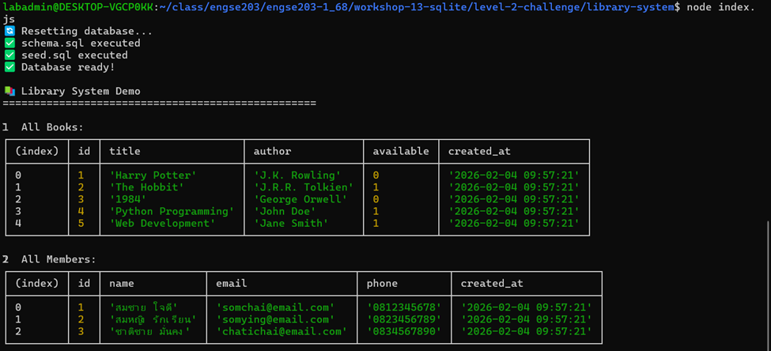
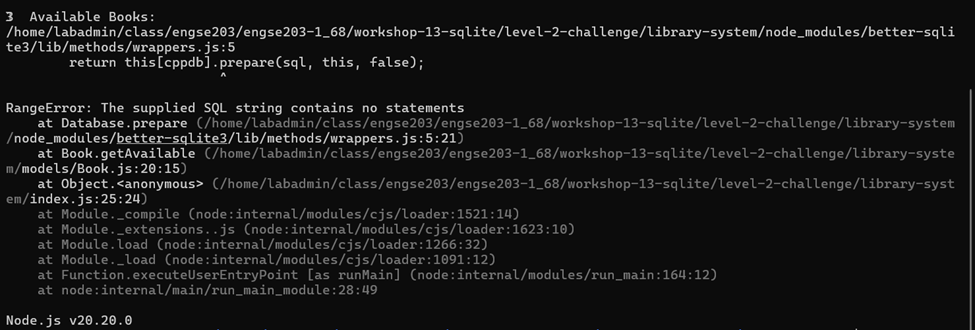
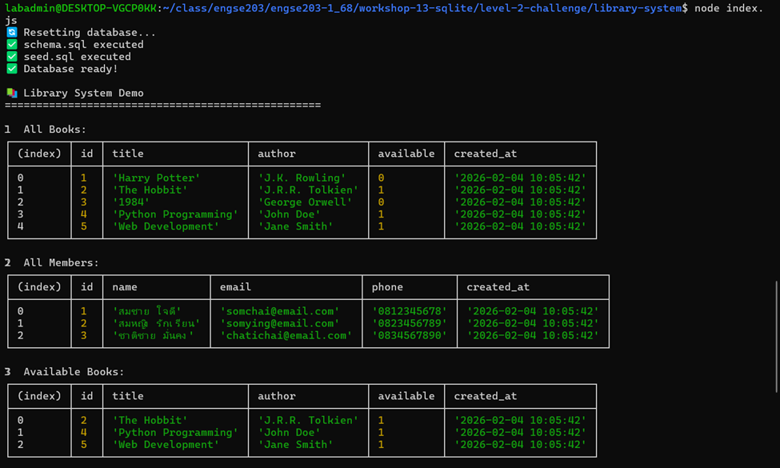
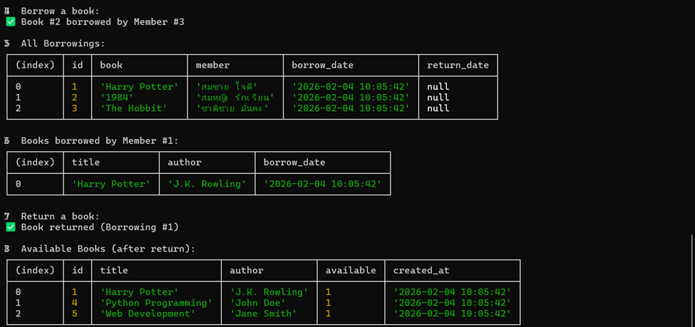
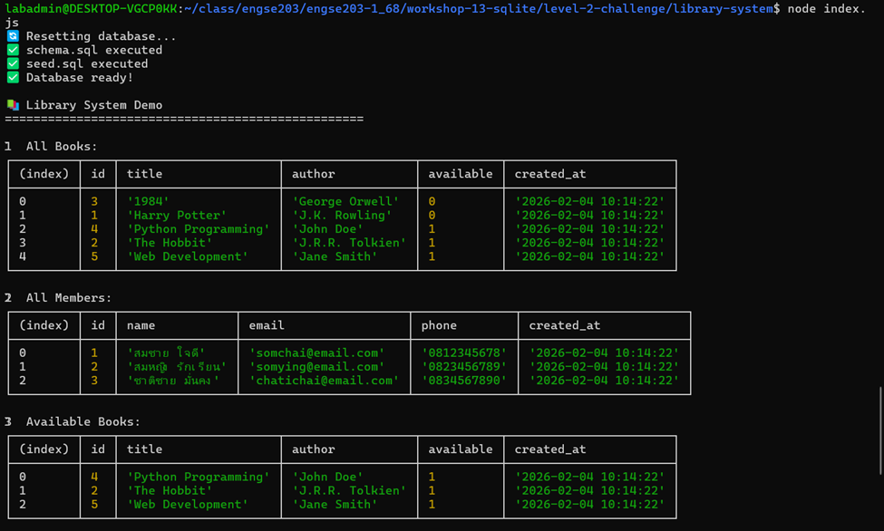
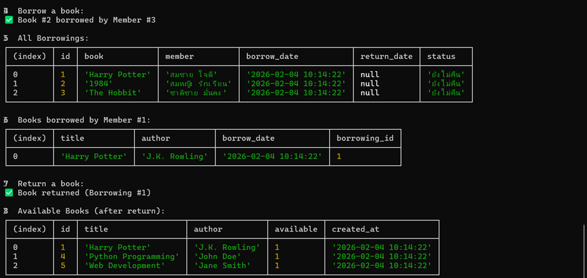

# 📊 บันทึกผลการทดลอง - Workshop 13 Level 2

## 👨‍🎓 ข้อมูลผู้ทดลอง
- **ชื่อ:** วิศรุต กอบคำ
- **วันที่ทดลอง:** 3 February 2026
- **หัวข้อ:** Simple Library System with SQLite
- **ระดับ:** Level 2 Challenge

---

## 🎯 วัตถุประสงค์
ทดลองการใช้งาน AI Assistant (GitHub Copilot) ในการพัฒนาระบบห้องสมุดด้วย SQLite โดยเปรียบเทียบประสิทธิภาพในการทำงานแบบ:
1. **No Hints** - ไม่มีคำแนะนำใดๆ
2. **Hints** - มีคำแนะนำพื้นฐาน
3. **Solutions** - มีเฉลยให้อ้างอิง

---

## 📋 รายละเอียดการทดลอง

### โครงสร้างโปรเจค
```
library-system/
├── models/
│   ├── Book.js       - จัดการข้อมูลหนังสือ
│   ├── Member.js     - จัดการข้อมูลสมาชิก
│   └── Borrowing.js  - จัดการการยืม-คืน
├── db.js             - Database connection
├── schema.sql        - สร้างโครงสร้างตาราง
├── seed.sql          - ข้อมูลเริ่มต้น
└── index.js          - Demo program
```

### ฟีเจอร์ที่ต้องพัฒนา
- ✅ ดึงหนังสือที่ว่าง (Book.getAvailable)
- ✅ ค้นหาหนังสือ (Book.search)
- ✅ เพิ่มหนังสือ/สมาชิก (Book.add, Member.add)
- ✅ ระบบยืม-คืนหนังสือ (Borrowing.borrow, Borrowing.returnBook)
- ✅ ดูรายการที่ยังไม่คืน (Borrowing.getUnreturned)

---

## 🔬 ผลการทดลอง

### 1️⃣ การทดลองแบบ No Hints (ไม่มีคำแนะนำ)

**การทำงาน:**
- ต้องใช้เวลาในการทดลองและแก้ไข

**ผลลัพธ์:**


*รูปที่ 1: ผลการรันโปรแกรมแบบ No Hints*


*รูปที่ 2: โค้ดที่ได้จากการทำงานแบบ No Hints*

**สังเกต:**
- อาจขาดรายละเอียดบางส่วน
- ต้องใช้เวลาในการ debug และปรับแต่ง

---

### 2️⃣ การทดลองแบบ Hints (มีคำแนะนำ)

**การทำงาน:**
- มี TODO comments และ hints ในโค้ด

**ผลลัพธ์:**


*รูปที่ 3: ผลการรันโปรแกรมแบบ Hints*


*รูปที่ 4: โค้ดที่ได้จากการทำงานแบบ Hints*

**สังเกต:**
- ลดเวลาในการแก้ไข
- โครงสร้าง SQL query ถูกต้องและชัดเจน

---

### 3️⃣ การทดลองแบบ Solutions (มีเฉลย)

**การทำงาน:**
- มีโค้ดเฉลยให้อ้างอิง

**ผลลัพธ์:**


*รูปที่ 5: ผลการรันโปรแกรมแบบ Solutions*


*รูปที่ 6: โค้ดที่ได้จากการทำงานแบบ Solutions*

**สังเกต:**
- เพิ่มฟีเจอร์เสริมได้ง่าย (validation, error handling)
- โค้ดมีคุณภาพและ best practices

---
