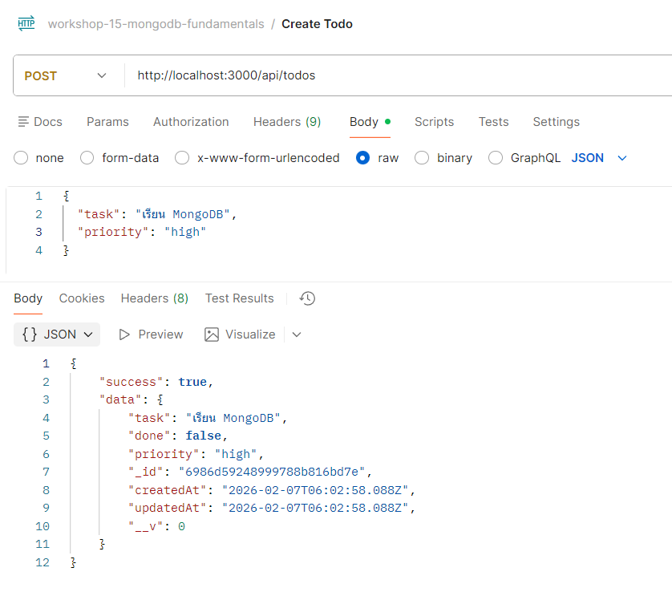
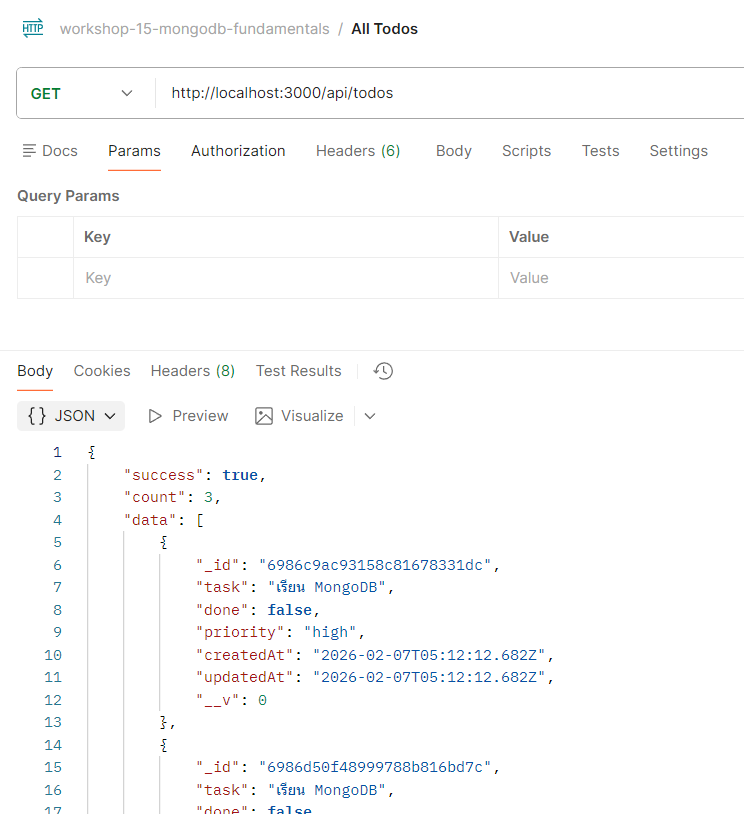
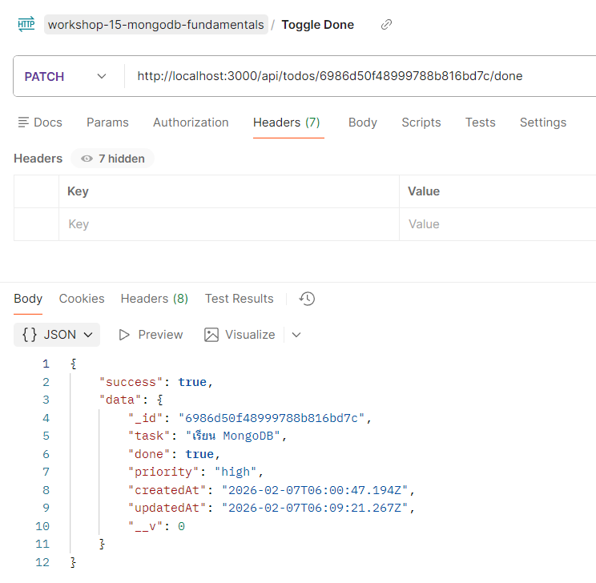
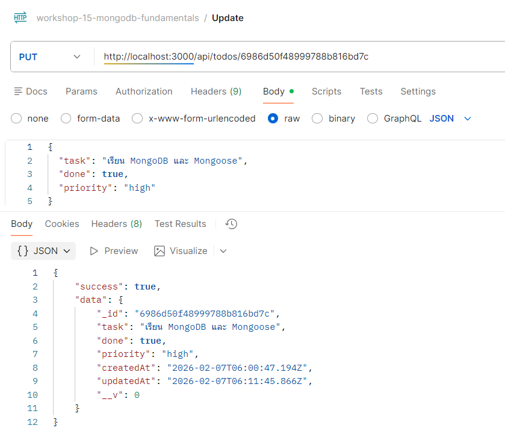
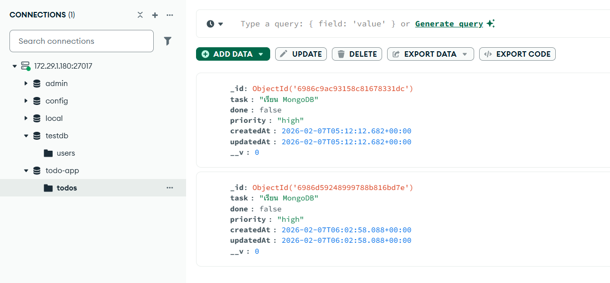
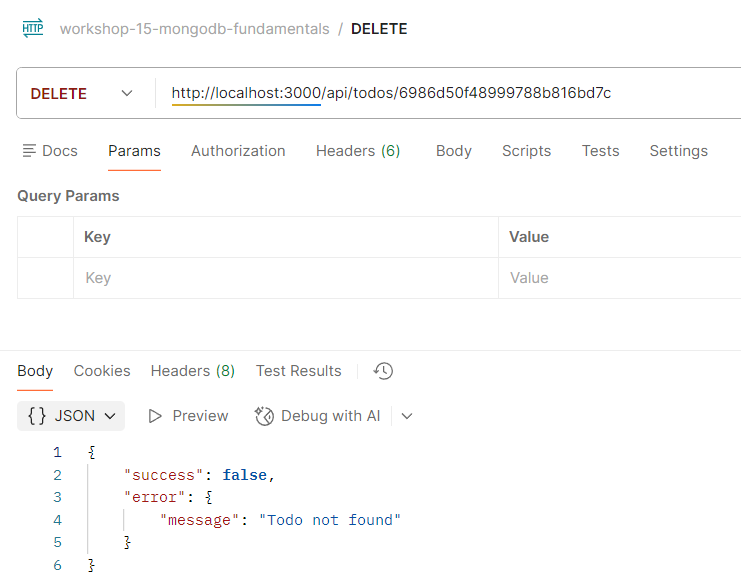
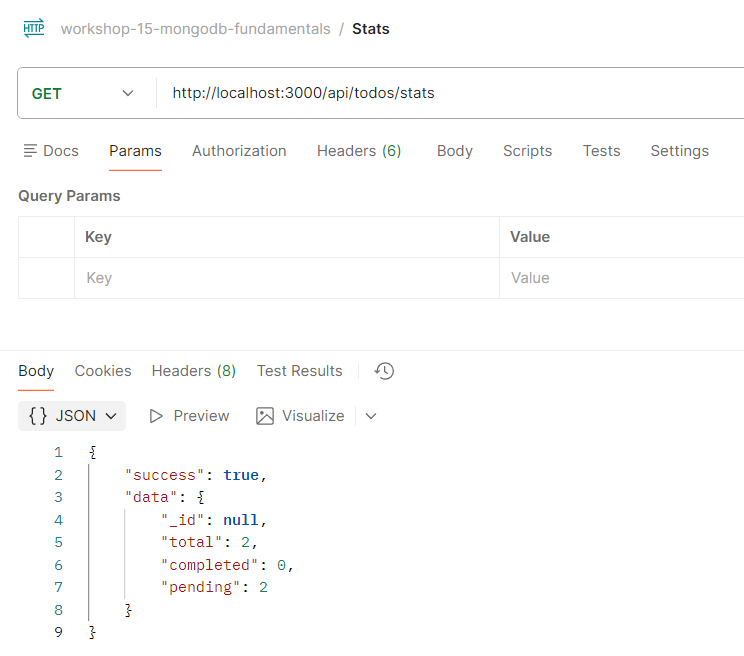
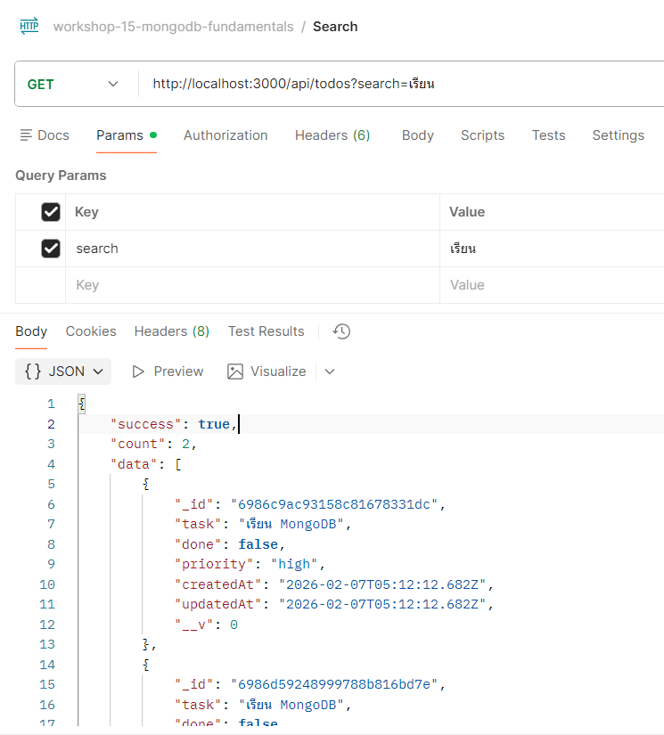
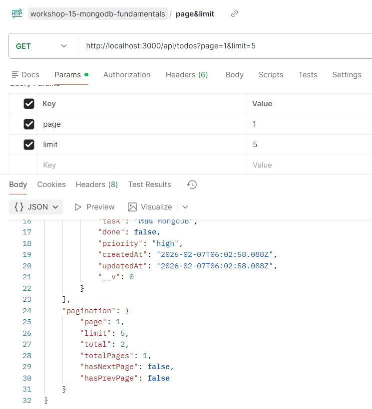
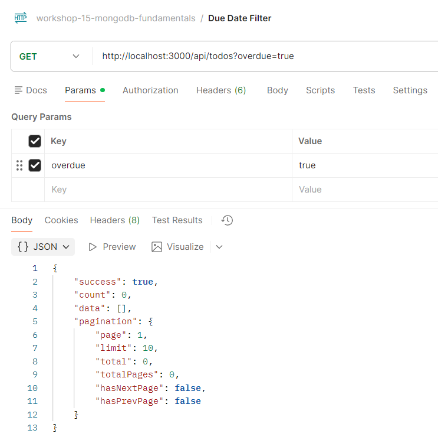

# 📊 ผลการทดสอบ - Workshop 15 Level 1

## 👤 ข้อมูลผู้ทดสอบ
- **ชื่อ:** วิศรุต กอบคำ
- **วันที่:** 7 กุมภาพันธ์ 2026
- **API Base URL:** http://localhost:3000

---

## 🧪 ผลการทดสอบด้วย Postman

### 1. 📝 POST - สร้าง Todo ใหม่

**Endpoint:**
```http
POST http://localhost:3000/api/todos
Content-Type: application/json
```

**Request Body:**
```json
{
  "task": "เรียน MongoDB",
  "priority": "high"
}
```

**ผลการทดสอบ:**



---

### 2. 📋 GET - ดึงข้อมูล Todos ทั้งหมด

**Endpoint:**
```http
GET http://localhost:3000/api/todos
```

**ผลการทดสอบ:**



---

### 3. 🔍 GET - กรองข้อมูลด้วย Query Parameters

**Endpoint:**
```http
GET http://localhost:3000/api/todos?done=false&priority=high
```

**Query Parameters:**
- `done=false` - กรองเฉพาะงานที่ยังไม่เสร็จ
- `priority=high` - กรองเฉพาะงานที่มีความสำคัญสูง

**ผลการทดสอบ:**


---

### 4. ✅ PATCH - สลับสถานะ Done

**Endpoint:**
```http
PATCH http://localhost:3000/api/todos/65b9f5e9c8d0a1234567890a/done
```

**คำอธิบาย:** สลับสถานะการทำงานเสร็จ/ไม่เสร็จ

**ผลการทดสอบ:**



---

### 5. ✏️ PUT - แก้ไขข้อมูล Todo

**Endpoint:**
```http
PUT http://localhost:3000/api/todos/65b9f5e9c8d0a1234567890a
Content-Type: application/json
```

**Request Body:**
```json
{
  "task": "เรียน MongoDB และ Mongoose",
  "done": true,
  "priority": "high"
}
```

**ผลการทดสอบ:**



---

### 6. 🗑️ DELETE - ลบ Todo

**Endpoint:**
```http
DELETE http://localhost:3000/api/todos/65b9f5e9c8d0a1234567890a
```

**ผลการทดสอบ:**



**ตรวจสอบการลบ:**



---

### 7. 📊 GET - สถิติของ Todos

**Endpoint:**
```http
GET http://localhost:3000/api/todos/stats
```

**Response:**
```json
{
  "success": true,
  "data": {
    "total": 5,
    "completed": 2,
    "pending": 3
  }
}
```

**ผลการทดสอบ:**



---

## 🎯 Challenge Tasks - ฟีเจอร์เพิ่มเติม

### Challenge 1: 🔍 Search - ค้นหา Todo

**Endpoint:**
```http
GET http://localhost:3000/api/todos?search=เรียน
```

**คำอธิบาย:** ค้นหา todo จากชื่องาน (task) แบบ case-insensitive

**Query Parameters:**
- `search` - คำค้นหาที่ต้องการหา

**Implementation:**
```javascript
exports.getAll = async (req, res) => {
  const { search } = req.query;
  if (search) {
    filter.task = { $regex: search, $options: 'i' };
  }
  // ใช้ MongoDB regex operator สำหรับการค้นหา
};
```

**ตัวอย่างการใช้งาน:**
- `?search=เรียน` - ค้นหา todos ที่มีคำว่า "เรียน"
- `?search=mongo` - ค้นหา todos ที่มีคำว่า "mongo"
- `?search=เรียน&priority=high` - ค้นหา + กรองตาม priority

**ผลการทดสอบ:**



---

### Challenge 2: 📄 Pagination - แบ่งหน้า

**Endpoint:**
```http
GET http://localhost:3000/api/todos?page=1&limit=10
```

**คำอธิบาย:** แบ่งผลลัพธ์เป็นหน้า ๆ เพื่อไม่ให้ดึงข้อมูลมากเกินไปในครั้งเดียว

**Query Parameters:**
- `page` - หมายเลขหน้า (default: 1)
- `limit` - จำนวนรายการต่อหน้า (default: 10)

**Implementation:**
```javascript
exports.getAll = async (req, res) => {
  const page = parseInt(req.query.page) || 1;
  const limit = parseInt(req.query.limit) || 10;
  const skip = (page - 1) * limit;
  
  const total = await Todo.countDocuments(filter);
  const todos = await Todo.find(filter).skip(skip).limit(limit);
  
  // Response พร้อม pagination metadata
};
```

**ตัวอย่างการใช้งาน:**
- `?page=1&limit=5` - แสดงหน้าแรก 5 รายการ
- `?page=2&limit=5` - แสดงหน้าที่ 2
- `?page=1&limit=10&search=เรียน` - แบ่งหน้าพร้อมค้นหา

**Response Format:**
```json
{
  "success": true,
  "count": 5,
  "data": [...],
  "pagination": {
    "page": 1,
    "limit": 5,
    "total": 12,
    "totalPages": 3,
    "hasNextPage": true,
    "hasPrevPage": false
  }
}
```

**ผลการทดสอบ:**



---

### Challenge 3: ⏰ Due Date Filter - กรองตามวันครบกำหนด

**Endpoint:**
```http
GET http://localhost:3000/api/todos?overdue=true
```

**คำอธิบาย:** กรองงานที่เลยกำหนดส่งแล้ว (overdue) และยังไม่เสร็จ

**Query Parameters:**
- `overdue=true` - แสดงเฉพาะงานที่เลยกำหนดแล้ว

**Implementation:**
```javascript
exports.getAll = async (req, res) => {
  const { overdue } = req.query;
  if (overdue === 'true') {
    filter.dueDate = { $lt: new Date() };  // น้อยกว่าวันนี้
    filter.done = false;                    // ยังไม่เสร็จ
  }
  // กรองงานที่ค้างทำ
};
```

**เงื่อนไข:**
- `dueDate < วันนี้` - วันครบกำหนดน้อยกว่าวันปัจจุบัน
- `done = false` - ยังทำไม่เสร็จ

**ตัวอย่างการใช้งาน:**
- `?overdue=true` - แสดงงานที่เลยกำหนดทั้งหมด
- `?overdue=true&priority=high` - งานสำคัญที่เลยกำหนด
- `?overdue=true&page=1&limit=5` - งานค้างแบบแบ่งหน้า

**ผลการทดสอบ:**



---
