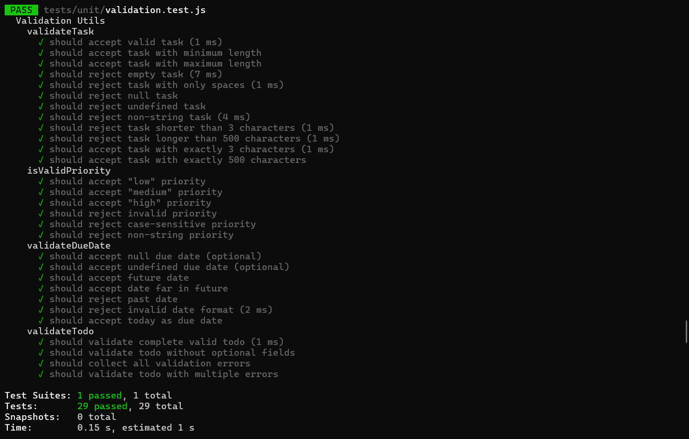
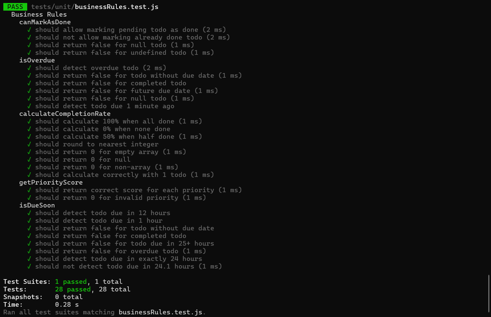

รัน test:
npm test validation.test.js

ผลลัพธ์:

รัน test:
npm test businessRules.test.js

ผลลัพธ์:

รัน test:
npm test dataProcessing.test.js

ผลลัพธ์:

รัน tests พร้อม coverage
npm run test:coverage

ผลลัพธ์:
