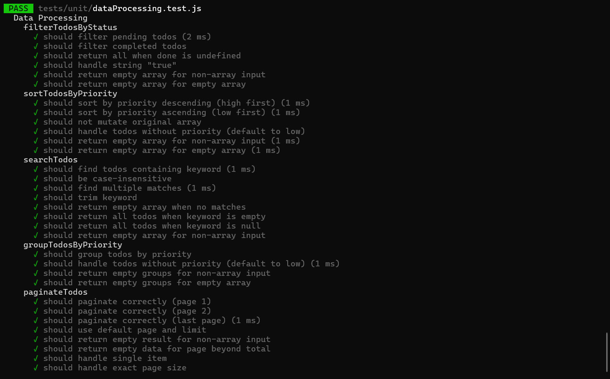
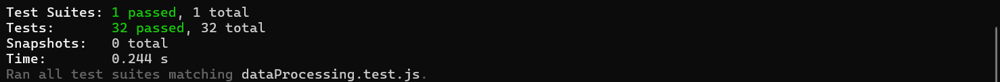
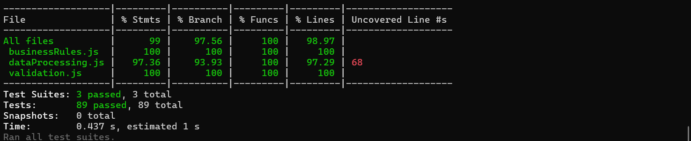
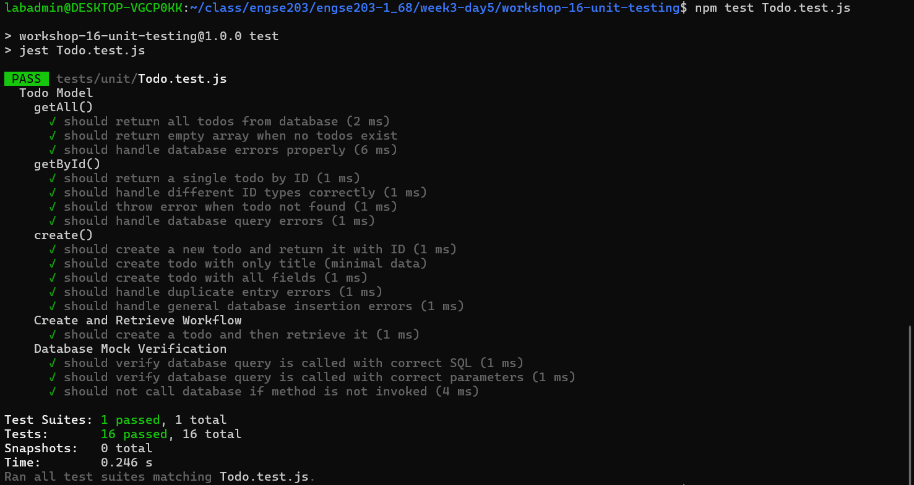
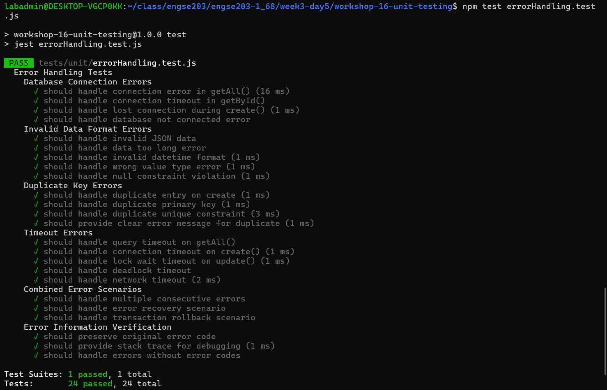
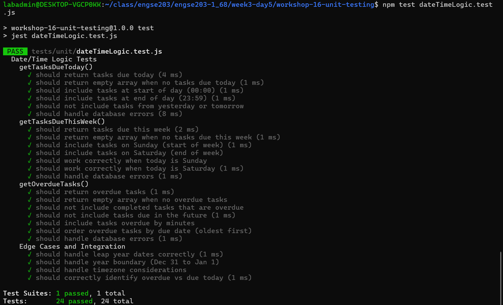

# 📊 ผลการทดสอบ - Workshop 16: Unit Testing

## 👤 ข้อมูลผู้ทดสอบ
- **ชื่อ:** วิศรุต กอบคำ
- **วันที่:** 11 กุมภาพันธ์ 2026

---

## 🧪 การทดสอบพื้นฐาน

### 1️⃣ Validation Tests
**คำสั่งรัน:**
```bash
npm test validation.test.js
```

**ผลลัพธ์:**


---

### 2️⃣ Business Rules Tests
**คำสั่งรัน:**
```bash
npm test businessRules.test.js
```

**ผลลัพธ์:**


---

### 3️⃣ Data Processing Tests
**คำสั่งรัน:**
```bash
npm test dataProcessing.test.js
```

**ผลลัพธ์:**




---

### 📈 Test Coverage Report
**คำสั่งรัน:**
```bash
npm run test:coverage
```

**ผลลัพธ์:**



---

## 🎯 Challenge Tasks

### Challenge 1: Test Todo Model (with Mock)
เขียน tests สำหรับ Todo Model ที่ต้องเชื่อม database (ใช้ mock)

// src/models/Todo.js (simplified)
const db = require('../config/database');

class Todo {
  static async getAll() {
    return await db.query('SELECT * FROM todos');
  }
  
  static async getById(id) {
    const result = await db.query('SELECT * FROM todos WHERE id = ?', [id]);
    return result[0];
  }
  
  static async create(data) {
    const result = await db.query('INSERT INTO todos SET ?', data);
    return { id: result.insertId, ...data };
  }
}

module.exports = Todo;
```

**Challenge:** เขียน tests โดยใช้ mock database

**คำสั่งรัน:**
```bash
npm test Todo.test.js
```

**ผลลัพธ์:**



---

### Challenge 2: Test Error Handling
เขียน tests สำหรับ error scenarios:

- Database connection error
- Invalid data format
- Duplicate key error
- Timeout error

**คำสั่งรัน:**
```bash
npm test errorHandling.test.js
```

**ผลลัพธ์:**




---

### Challenge 3: Test Date/Time Logic
เขียน tests สำหรับ time-sensitive functions:

- getTasksDueToday()
- getTasksDueThisWeek()
- getOverdueTasks()

**คำสั่งรัน:**
```bash
npm test dateTimeLogic.test.js
```

**ผลลัพธ์:**


