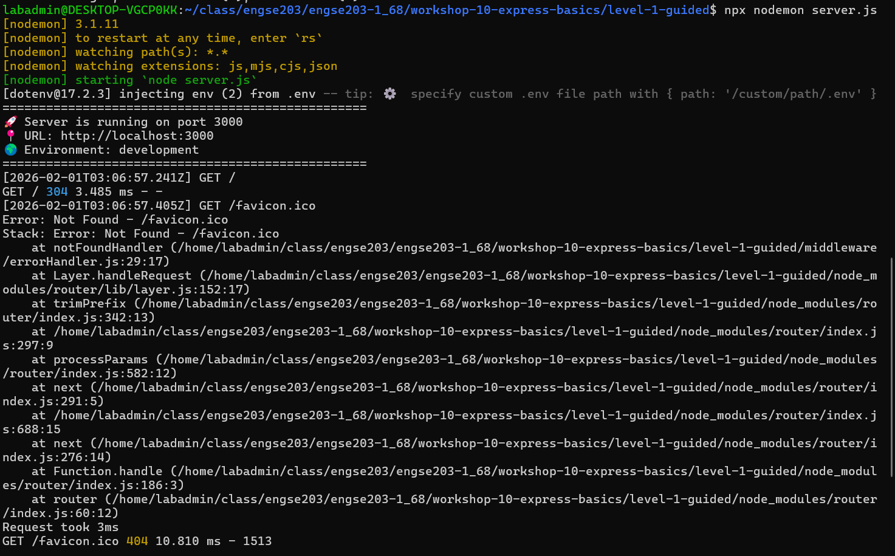
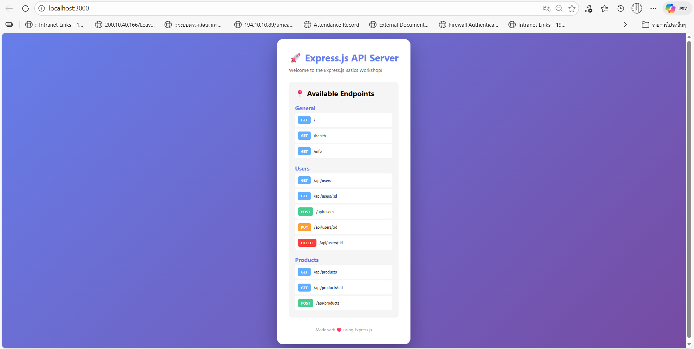

# 📊 ผลการทดลอง - Workshop 10 Level 1

## ผู้ทดลอง
- ชื่อ: [วิศรุต กอบคำ]
- วันที่: [1 Feb 2026]

## การทดสอบ Endpoints


### 1. GET /api/users
**Request:**
```bash
curl http://localhost:3000/api/users
```

Response: [บันทึก response]

สังเกต: [บันทึกสิ่งที่สังเกตเห็น]

2. POST /api/users
[บันทึกผลการทดสอบ]

3. Middleware Testing
[บันทึกการทำงานของ middleware]