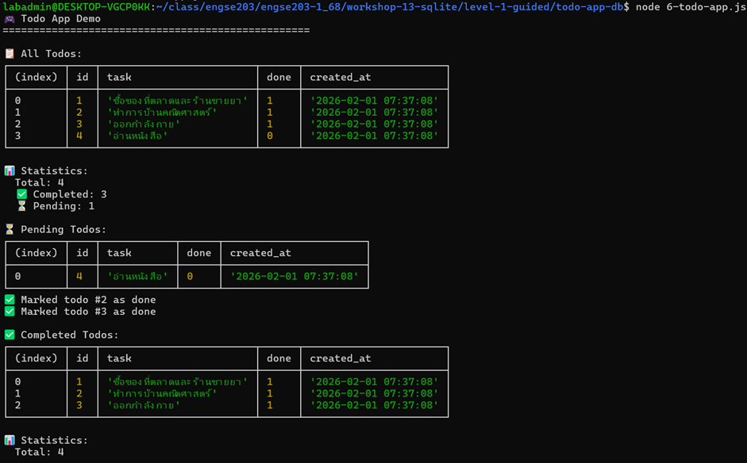
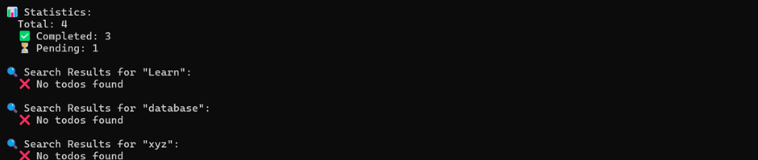
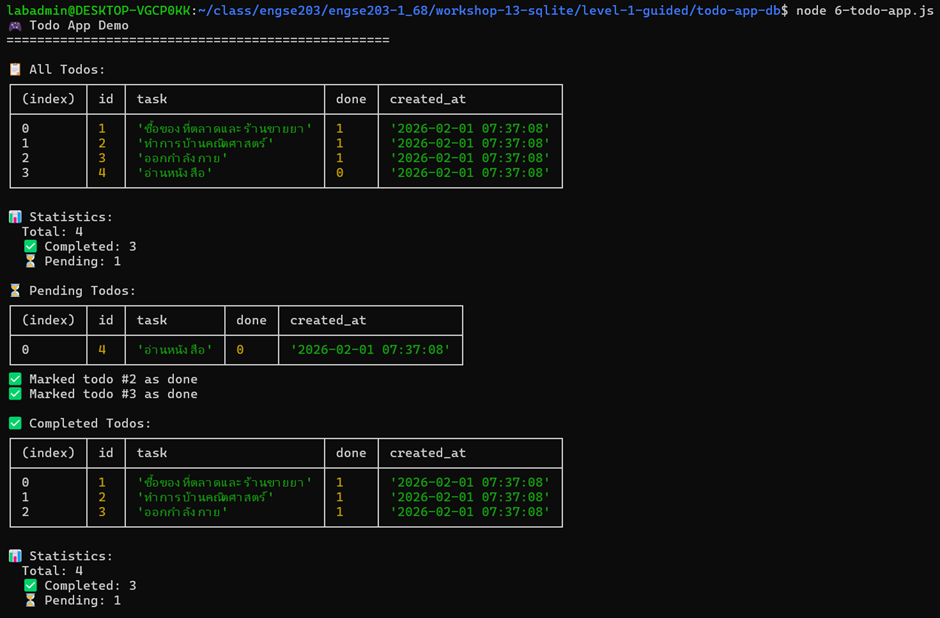
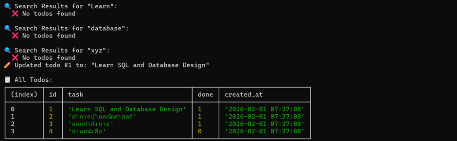
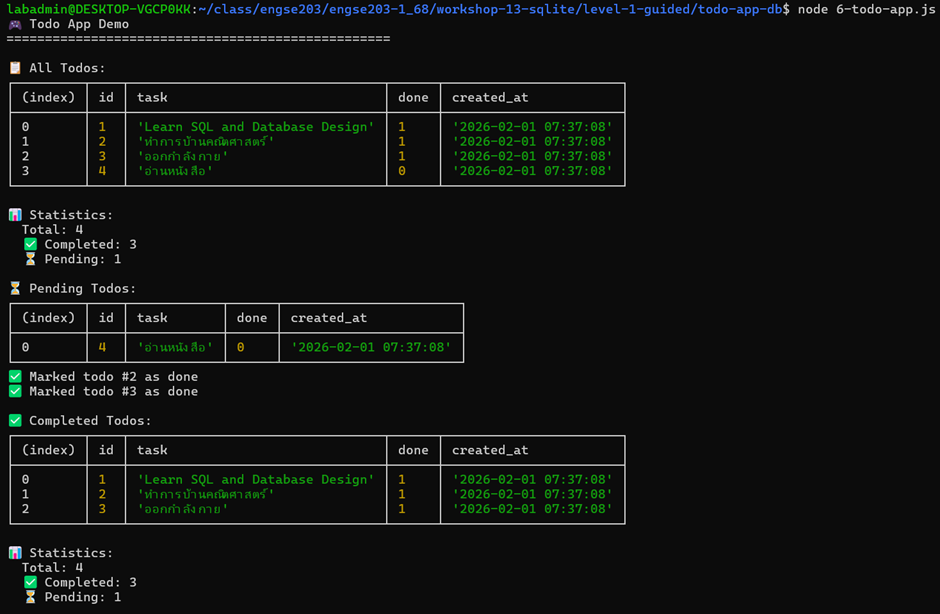
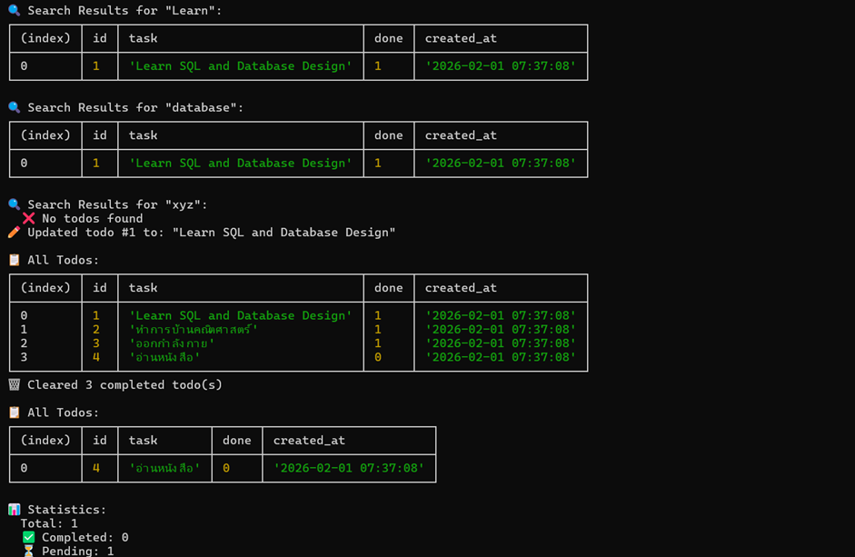
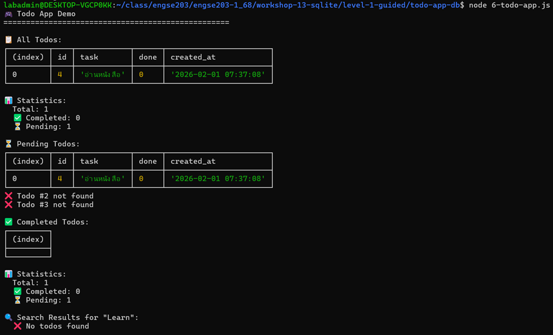
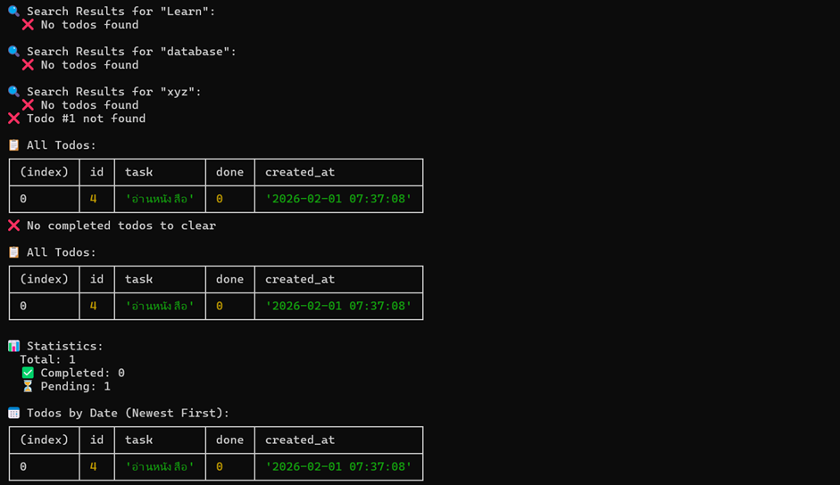

# 📊 บันทึกผลการทดลอง - Workshop 13 Level 1

## ผู้ทดลอง
- ชื่อ: วิศรุต กอบคำ
- วันที่: 3 Feb 2026


## 🎯 Challenge Tasks ที่ทำเพิ่ม

### Challenge 1: ค้นหา todo (searchTodos)
**โค้ดที่เขียน:**
  // Challenge 1: ค้นหา todo
  searchTodos(keyword) {
    const todos = db.prepare('SELECT * FROM todos WHERE task LIKE ?').all(`%${keyword}%`);
    console.log(`\n🔍 Search Results for "${keyword}":`);
    if (todos.length > 0) {
      console.table(todos);
    } else {
      console.log('  ❌ No todos found');
    }
  }


// Challenge 1: ทดสอบการค้นหา
app.searchTodos('Learn');
app.searchTodos('database');
```

**ผลการทดสอบ:**
```


```


---

### Challenge 2: แก้ไข task (updateTask)
**โค้ดที่เขียน:**
// Challenge 2: แก้ไข task
  updateTask(id, newTask) {
    const update = db.prepare('UPDATE todos SET task = ? WHERE id = ?');
    const result = update.run(newTask, id);
    if (result.changes > 0) {
      console.log(`✏️ Updated todo #${id} to: "${newTask}"`);
    } else {
      console.log(`❌ Todo #${id} not found`);
    }
  }


// Challenge 2: ทดสอบการแก้ไข task
app.updateTask(1, 'Learn SQL and Database Design');
app.showAll(); // ดูผลลัพธ์หลังแก้ไข
```

**ผลการทดสอบ:**
```


```


---

### Challenge 3: ลบที่เสร็จหมด (clearCompleted)
**โค้ดที่เขียน:**
  // Challenge 3: ลบที่เสร็จหมด
  clearCompleted() {
    const del = db.prepare('DELETE FROM todos WHERE done = 1');
    const result = del.run();
    if (result.changes > 0) {
      console.log(`🗑️ Cleared ${result.changes} completed todo(s)`);
    } else {
      console.log('❌ No completed todos to clear');
    }
  }


// Challenge 3: ทดสอบการลบที่เสร็จหมด
app.clearCompleted();
app.showAll(); // ดูผลลัพธ์หลังลบ
app.showStats(); // ดูสถิติใหม่
```

**ผลการทดสอบ:**
```


```


---

### Challenge 4: เรียงลำดับตามวันที่ (showByDate)
**โค้ดที่เขียน:**
  // Challenge 4: เรียงลำดับ
  showByDate() {
    const todos = db.prepare('SELECT * FROM todos ORDER BY created_at DESC').all();
    console.log('\n📅 Todos by Date (Newest First):');
    console.table(todos);
  }


// Challenge 4: ทดสอบการเรียงลำดับตามวันที่
app.showByDate();
```

**ผลการทดสอบ:**
```


```


---


