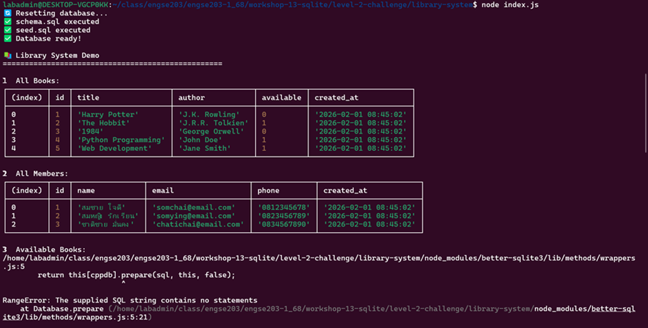
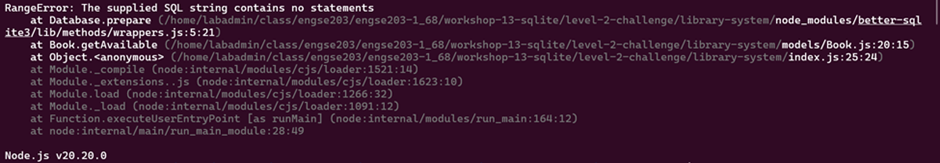
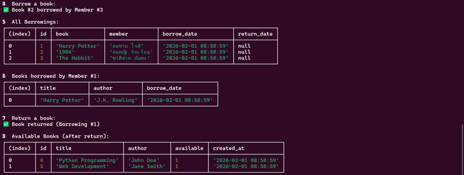
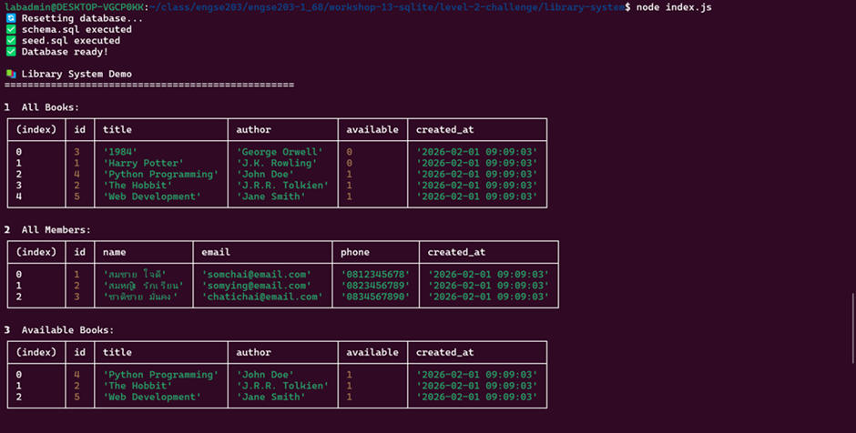
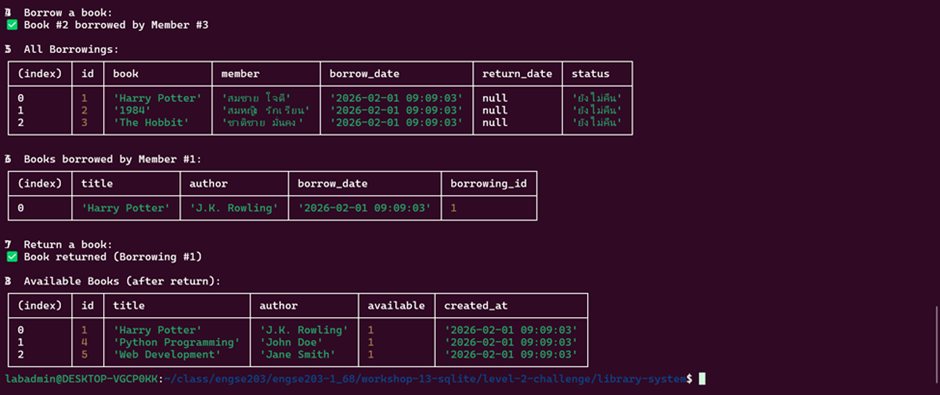

## 📊 บันทึกผลการทดลอง - Workshop 13 Level 2
ผู้ทดลอง
ชื่อ: วิศรุต กอบคำ
วันที่: 3 Feb 2026

---

## 🎯 วัตถุประสงค์การทดลอง

เพื่อทดสอบการทำงานของระบบห้องสมุดด้วย SQLite โดยเปรียบเทียบผลลัพธ์ระหว่าง:
1. **กรณีที่ 1:** ใช้โค้ดจาก Hints ในใบงาน
2. **กรณีที่ 2:** ใช้โค้ดจาก Solution ที่สมบูรณ์

---

## 🧪 Experiment 1: ใช้โค้ดจาก Hints

### 📝 รายละเอียด
จากรูปที่ 1-3: ทดสอบโค้ดที่เขียนตาม hints ในใบงาน
- **โครงสร้างโค้ด:** เขียนตาม TODO sections พื้นฐาน
- **Borrowing.getAll():** ไม่มี status column (แสดงเฉพาะ return_date)
- **Member.getBorrowedBooks():** ไม่มี borrowing_id ในผลลัพธ์

### ⚠️ ปัญหาที่พบ (จากรูปที่ 1-2)
```
RangeError: The supplied SQL string contains no statements
    at Database.prepare (node_modules/better-sqlite3/lib/methods/wrappers.js:5:21)
    at Object.<anonymous> (models/Book.js:20:15)
    at Module._compile (node:internal/modules/cjs/loader:1521:14)
```

**สาเหตุ:** SQL query ใน `Book.getAvailable()` เป็น string ว่าง (`''`) หรือมีเฉพาะ comment

**วิธีแก้ไข:** เพิ่ม SQL query ที่สมบูรณ์:
```javascript
static getAvailable() {
  const sql = `
    SELECT * FROM books 
    WHERE available = 1
    ORDER BY title
  `;
  return db.prepare(sql).all();
}
```

### 🖥️ ผลการทดลอง





### 📊 สรุปผล Experiment 1
**จากรูปที่ 3 (หลังแก้ไข error แล้ว):**



#### ⚠️ ข้อจำกัดที่พบ:
- ❌ **ไม่มี status column** - ดู return_date ยาก ต้องดูว่าเป็น null หรือมีค่า
- ❌ **ไม่มี borrowing_id** - ใน getBorrowedBooks() ทำให้ไม่รู้ว่าต้องคืนรายการไหน
- ⚠️ **Error ตอนแรก** - ต้องแก้ไข SQL query ที่ว่างใน getAvailable() ก่อนใช้งานได้

---

## 🧪 Experiment 2: ใช้โค้ดจาก Solution

### 📝 รายละเอียด
จากรูปที่ 4-5: ทดสอบโค้ดจาก solution version ที่สมบูรณ์
- **โครงสร้างโค้ด:** ใช้ solution ที่มี CASE statement และ computed columns
- **Borrowing.getAll():** มี **status column** แสดงสถานะเป็นภาษาไทย
  - `'ยังไม่คืน'` เมื่อ return_date IS NULL
  - `'คืนแล้ว'` เมื่อมี return_date
- **Member.getBorrowedBooks():** มี **borrowing_id** ในผลลัพธ์ เพื่อให้ผู้ใช้รู้ว่าต้องคืนรายการไหน
- **SQL Features:** ใช้ CASE WHEN statement สำหรับ conditional logic

### 🖥️ ผลการทดลอง





**สังเกตความแตกต่างจาก Experiment 1:**
- ✅ **มี status column** - แสดงข้อความภาษาไทย 'ยังไม่คืน' แทน NULL ทำให้อ่านง่าย
- ✅ **มี borrowing_id** - ผู้ใช้เห็นชัดเจนว่าต้อง `returnBook(1)` เพื่อคืน Harry Potter
- ✅ **UI/UX ดีขึ้น** - ไม่ต้องตีความ NULL หรือค้นหา ID เอง
- ✅ **ไม่มี error** - โค้ดสมบูรณ์ รันได้ทันทีโดยไม่ต้องแก้ไข

---
